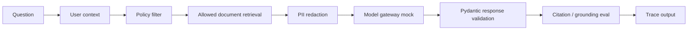

# CareShield Knowledge Assistant

A tiny, public-safe GenAI platform demo for synthetic healthcare policy Q&A.

The goal is not to build a flashy chatbot. The goal is to demonstrate the
production controls around a GenAI/RAG workflow:

- policy-aware retrieval before model input
- synthetic PII/PHI redaction
- model gateway abstraction
- Pydantic structured responses
- citation and groundedness-style evals
- trace events for debugging and audit
- CLI and FastAPI/OpenAPI entry points

All data in this repository is synthetic. It contains no real patient,
company, hospital, or production data.

## Why This Exists

Enterprise GenAI systems usually fail around the model, not inside the model:

- unauthorized documents enter the prompt
- sensitive identifiers leak into logs or responses
- provider calls are scattered across apps
- responses are loose text instead of typed contracts
- no one can prove whether an answer was grounded or cited

CareShield shows a small but complete governed flow.



## Example Use Case

A nurse asks:

> Can I send a patient discharge summary to an external vendor?

CareShield:

1. Builds role context for `nurse`.
2. Filters documents before retrieval.
3. Retrieves only documents the nurse is allowed to see.
4. Redacts synthetic sensitive identifiers from evidence.
5. Calls a deterministic mock model gateway.
6. Validates the answer shape with Pydantic.
7. Checks citations, grounding, PII redaction, and policy safety.
8. Returns trace events explaining the flow.

## Quick Start

```bash
uv sync --dev
make test
make demo
```

Or run directly:

```bash
uv run careshield ask \
  --role nurse \
  --question "Can I send a patient discharge summary to an external vendor?"
```

List roles:

```bash
uv run careshield roles
```

## API / OpenAPI Demo

Start the FastAPI app:

```bash
make api
```

Open:

```text
http://127.0.0.1:8088/docs
```

Call the API:

```bash
curl -s http://127.0.0.1:8088/ask \
  -H "content-type: application/json" \
  -d '{
    "role": "vendor_manager",
    "question": "What should be redacted before sharing data with a vendor?"
  }' | python -m json.tool
```

## What The Response Shows

```json
{
  "answer": "Only approved, de-identified...",
  "confidence": "high",
  "citations": [
    {
      "doc_id": "patient-summary-redaction-guide",
      "title": "Patient Summary Redaction Guide"
    }
  ],
  "redactions": ["email", "phone", "medical_record_number"],
  "eval": {
    "citations_present": true,
    "grounded": true,
    "pii_redacted": true,
    "policy_safe": true,
    "score": 100
  },
  "trace": [
    {"step": "request", "status": "ok"},
    {"step": "policy_retrieval", "status": "ok"},
    {"step": "model_gateway", "status": "ok"}
  ]
}
```

## Architecture

```text
src/careshield/
  app.py          orchestration flow
  api.py          FastAPI/OpenAPI wrapper
  cli.py          local demo entry point
  data.py         synthetic healthcare policy docs
  policy.py       role and sensitivity access checks
  retrieval.py    metadata-filtered retrieval
  pii.py          deterministic synthetic PII redaction
  gateway.py      mock model gateway adapter
  schemas.py      Pydantic request/response contracts
  evals.py        citation, grounding, redaction, policy checks
  tracing.py      trace event helper
```

## Interview Talk Track

> I built CareShield as a small governed GenAI/RAG assistant using synthetic
> healthcare policy documents. The important part is the platform control flow:
> user context is extracted, policy filters documents before retrieval, sensitive
> identifiers are redacted, the model call goes through a gateway abstraction,
> the response is validated with Pydantic, and an eval report checks citations,
> grounding, PII redaction, and policy safety. It is intentionally deterministic
> so the security and quality controls are testable offline.

## AWS Deployment Mapping

This repo runs locally by default. A production-style AWS mapping would be:

```text
API Gateway
  -> Lambda / ECS service
  -> policy and retrieval service
  -> OpenSearch Serverless or Aurora pgvector
  -> Bedrock or approved model gateway
  -> Pydantic validation
  -> CloudWatch / OpenTelemetry traces
  -> Secrets Manager and KMS
```

The demo keeps the provider mocked so tests never require API keys.

## Test Coverage

```bash
make test
```

Tests cover:

- role-based policy filtering
- retrieval pre-filtering
- synthetic PII redaction
- structured response validation
- citation and grounding-style evals
- FastAPI `/health` and `/ask`

## Public-Safety Notes

- No real PHI/PII is stored.
- No real provider key is required.
- All examples are synthetic and safe for a public GitHub repository.
- The mock gateway exists to show platform boundaries without sending data to
  an external model provider.
