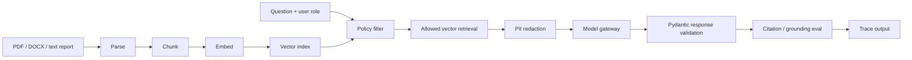

# CareShield Knowledge Assistant

A small, public-safe GenAI learning project for governed healthcare knowledge
assistance.

The goal is to practice production-style GenAI engineering, not only prompting.
CareShield intentionally keeps the data synthetic, but the architecture mirrors
real RAG systems:

- document ingestion for text, Markdown, PDF, and Word files
- chunking, local embeddings, Chroma vector storage, and retrieval
- policy-aware retrieval before model input
- synthetic PII/PHI redaction
- model gateway abstraction with mock and AWS Bedrock adapter examples
- Pydantic structured responses
- citation and groundedness-style evals
- golden eval dataset in CI
- Ruff linting/formatting and mypy type checks
- trace events for debugging and audit
- CLI and FastAPI/OpenAPI entry points

All data in this repository is synthetic. It contains no real patient,
company, hospital, or production data.

## Why This Exists

Enterprise GenAI systems usually fail around the model, not inside the model:

- unauthorized documents enter the prompt
- sensitive identifiers leak into logs or responses
- provider calls are scattered across apps
- responses are loose text instead of typed contracts
- no one can prove whether an answer was grounded or cited

CareShield shows a small but complete governed flow.



The default model path is deterministic and offline. The code also includes an
AWS Bedrock Runtime Converse adapter so the same gateway boundary can be mapped
to Bedrock and Bedrock Guardrails when credentials and an approved model are
available.

## Example Use Case

A nurse asks:

> Can I send a patient discharge summary to an external vendor?

CareShield:

1. Builds role context for `nurse`.
2. Filters documents before retrieval.
3. Retrieves only documents the nurse is allowed to see.
4. Redacts synthetic sensitive identifiers from evidence.
5. Calls a deterministic mock model gateway.
6. Validates the answer shape with Pydantic.
7. Checks citations, grounding, PII redaction, and policy safety.
8. Returns trace events explaining the flow.

## Quick Start

```bash
uv sync --dev
make ci
make demo-ask
make demo-doc
```

Or run directly:

```bash
uv run careshield ask \
  --role nurse \
  --question "Can I send a patient discharge summary to an external vendor?"
```

List roles:

```bash
uv run careshield roles
```

Analyze a local report-like document:

```bash
uv run careshield analyze-doc \
  --file examples/synthetic-care-report.md \
  --role nurse \
  --question "What must be redacted before vendor sharing?"
```

## API / OpenAPI

Start the FastAPI app:

```bash
make api
```

Open:

```text
http://127.0.0.1:8088/docs
```

Call the API:

```bash
curl -s http://127.0.0.1:8088/ask \
  -H "content-type: application/json" \
  -d '{
    "role": "vendor_manager",
    "question": "What should be redacted before sharing data with a vendor?"
  }' | python -m json.tool
```

Analyze an uploaded document:

```bash
curl -s http://127.0.0.1:8088/documents/analyze \
  -F "file=@examples/synthetic-care-report.md" \
  -F "role=nurse" \
  -F "sensitivity=clinical" \
  -F "question=What must be redacted before vendor sharing?" \
  | python -m json.tool
```

Supported input formats are `.txt`, `.md`, `.pdf`, and `.docx`.

More examples:

- [docs/setup-guide.md](docs/setup-guide.md)
- [docs/examples.md](docs/examples.md)
- [docs/architecture.md](docs/architecture.md)
- [docs/security.md](docs/security.md)

The default vector backend is Chroma with a deterministic local embedding model,
`local-hash-embedding-v1`. This keeps the app runnable without API keys while
still teaching the vector DB workflow. The adapter boundary is where you can
later plug in Bedrock embeddings, OpenAI embeddings, Hugging Face embeddings,
OpenSearch vector search, Aurora pgvector, or another approved vector service.

## What The Response Shows

```json
{
  "answer": "Only approved, de-identified...",
  "confidence": "high",
  "citations": [
    {
      "doc_id": "patient-summary-redaction-guide",
      "title": "Patient Summary Redaction Guide"
    }
  ],
  "redactions": ["email", "phone", "medical_record_number"],
  "eval": {
    "citations_present": true,
    "grounded": true,
    "pii_redacted": true,
    "policy_safe": true,
    "score": 100
  },
  "trace": [
    {"step": "request", "status": "ok"},
    {"step": "policy_retrieval", "status": "ok"},
    {"step": "model_gateway", "status": "ok"}
  ]
}
```

## Architecture

```text
src/careshield/
  contracts/       Pydantic request and response schemas
  guardrails/      policy checks, PII redaction, and deterministic evals
  interfaces/      FastAPI/OpenAPI and CLI entry points
  pipeline/        assistant orchestration, model gateway, and trace events
  retrieval/       synthetic data, parsing, chunking, embeddings, Chroma adapter
```

## Project Guide

CareShield is a small governed GenAI/RAG assistant using synthetic healthcare
documents. The important part is the platform control flow: documents can be
parsed, chunked, embedded, indexed, filtered by user context, retrieved with
authorization controls, redacted, sent through a gateway abstraction, validated
with Pydantic, and checked by evals for citations, grounding, PII redaction,
and policy safety. It is intentionally deterministic so the security and
quality controls are testable offline and in CI, while the vector layer uses
Chroma to teach a real GenAI storage pattern.

Read the full architecture guide: [docs/architecture.md](docs/architecture.md)

## AWS Deployment Mapping

This repo runs locally by default. A production-style AWS mapping would be:

```text
API Gateway
  -> Lambda / ECS service
  -> parser workers for PDF / DOCX / text
  -> embedding provider
  -> policy and retrieval service
  -> OpenSearch Serverless or Aurora pgvector
  -> Bedrock or approved model gateway
  -> Pydantic validation
  -> CloudWatch / OpenTelemetry traces
  -> Secrets Manager and KMS
```

The local app keeps the provider mocked so tests never require API keys.

## Test Coverage

```bash
make test
make ci
make security
```

Tests cover:

- document parsing for text, Markdown, PDF, and Word files
- chunking and ingestion metadata
- local embedding and vector retrieval
- role-based policy filtering
- retrieval pre-filtering
- synthetic PII redaction
- structured response validation
- citation and grounding-style evals
- FastAPI `/health`, `/ask`, and `/documents/analyze`
- golden eval cases from `evals/golden_dataset.json`
- Ruff lint/format checks, mypy type checks, dependency audit, and Docker build checks in CI

## Streamlit UI

Run a small local UI:

```bash
make ui
```

Use it to switch between built-in policy Q&A and uploaded document analysis.

## Public-Safety Notes

- No real PHI/PII is stored.
- No real provider key is required.
- All examples are synthetic and safe for a public GitHub repository.
- The mock gateway exists to show platform boundaries without sending data to
  an external model provider.
