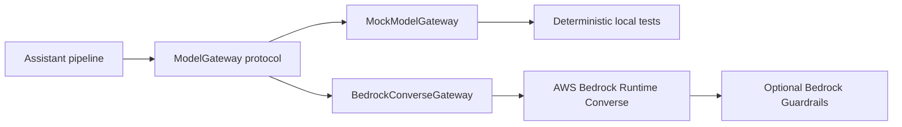
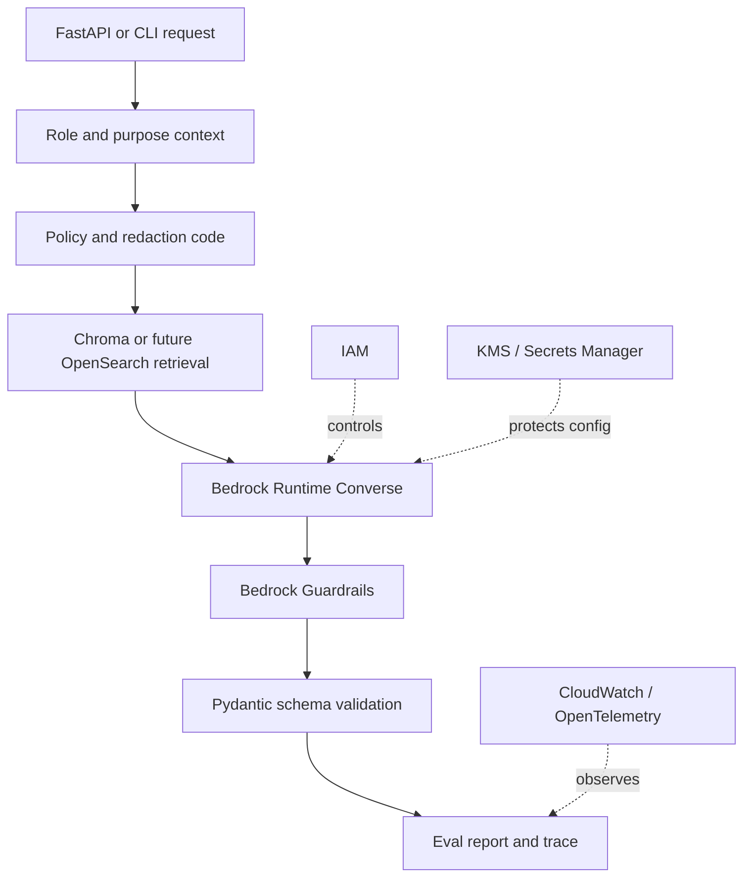
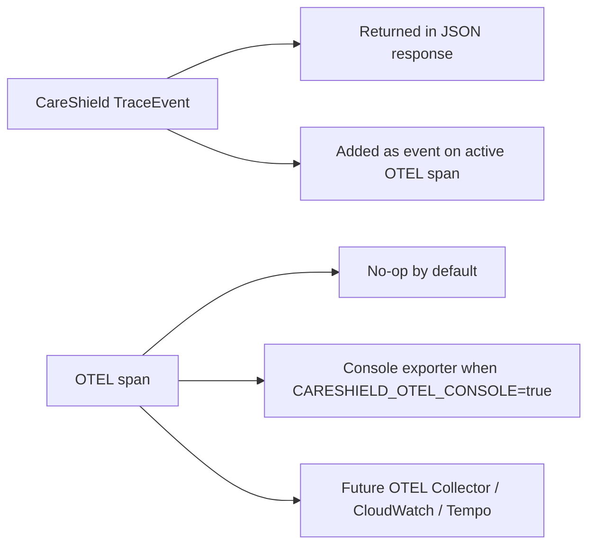

# Architecture Guide

CareShield is a small governed GenAI/RAG learning project built on synthetic
healthcare documents. It is designed to show the engineering controls around
retrieval, policy, redaction, model gateways, structured output validation,
evals, and traces.

All examples are synthetic and public-safe.

## Core Flow

```text
request
-> user context
-> policy filter
-> document parse/chunk/embed/index
-> Chroma vector retrieval
-> PII/PHI-style redaction
-> model gateway
-> Pydantic response validation
-> deterministic evals
-> trace output
-> OpenTelemetry spans
```

The key design point is that unauthorized data never enters the prompt. That is
the difference between a standalone chatbot and a governed GenAI platform pattern.

## Main Components

- `contracts`: Pydantic request, response, evidence, eval, trace, and ingestion models.
- `retrieval`: parsers, chunking, deterministic embeddings, keyword retrieval, and Chroma vector storage.
- `guardrails`: role/sensitivity policy, synthetic PII/PHI redaction, and deterministic eval checks.
- `pipeline`: assistant orchestration, model gateway boundary, and trace collection.
- `interfaces`: CLI and FastAPI/OpenAPI entry points.

## Why Chroma Is The Default

The vector store uses Chroma by default because this project is for hands-on
GenAI learning. Chroma makes the parse -> chunk -> embed -> index -> retrieve
workflow visible locally without requiring cloud credentials. The adapter
boundary keeps the app ready for a later migration to OpenSearch, Aurora
pgvector, or another approved vector service.

The local embedding model is deterministic and hash-based. It is not intended
to compete with production embedding models; it exists so the repository can run
offline and still teach the vector retrieval shape.

## Policy And Prompt Safety

CareShield filters evidence before the model gateway is called:

1. The request role is converted into a `UserContext`.
2. Candidate documents are checked against sensitivity and allowed roles.
3. Chroma retrieval uses metadata filters for role and sensitivity.
4. A second Python policy check runs after Chroma query results return.
5. Redacted evidence becomes the only context passed to the model gateway.

This keeps the model from seeing unauthorized chunks in the first place.

## Gateway Boundary



The mock gateway is the default because deterministic tests should not need API
keys, network access, or changing model behavior. The Bedrock gateway shows the
same boundary mapped to AWS:

- `boto3.client("bedrock-runtime")`
- `converse(...)` for synchronous model calls
- `guardrailConfig` for Bedrock Guardrails
- provider output converted back into the same `GatewayResult` contract

Application policy still runs before the Bedrock adapter. Bedrock Guardrails are
an extra provider-side control, not a replacement for app-level authorization,
redaction, schemas, tests, or evals.

## AWS Control Plane View



## Eval Strategy

The evals are intentionally deterministic:

- citations must be present
- the answer must overlap with retrieved evidence
- redaction patterns must not remain in the answer
- policy-safe evidence must be present
- golden eval cases run in CI

This gives quick regression checks without using a judge model or live provider.

## Tracing Strategy

CareShield has two tracing layers:

- response trace events: small `TraceEvent` objects returned in API/CLI output
- OpenTelemetry spans: provider-neutral observability data for tools such as
  OTEL Collector, Jaeger, Tempo, Datadog, or CloudWatch-compatible pipelines

The response trace is useful for learning and debugging one request. OTEL is
useful when the app runs as a service and you want timing, span hierarchy, and
exporters.



## AWS Mapping

```text
API Gateway
-> Lambda or ECS
-> parser workers for PDF / DOCX / text
-> embedding provider
-> policy/retrieval service
-> OpenSearch Serverless or Aurora pgvector
-> Bedrock or approved model gateway
-> Pydantic validation
-> CloudWatch/OpenTelemetry trace
```

## Extension Ideas

- Add a real provider adapter behind the gateway, such as Bedrock or OpenAI.
- Add OpenTelemetry spans around parse, retrieve, gateway, and eval stages.
- Add Terraform for an AWS deployment profile.
- Add a persistent Chroma profile for local experiments.
- Add more golden eval cases and adversarial policy tests.
